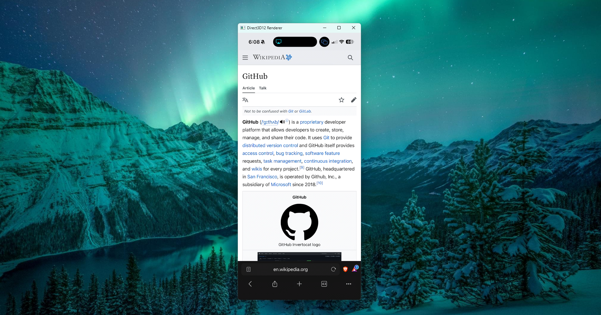
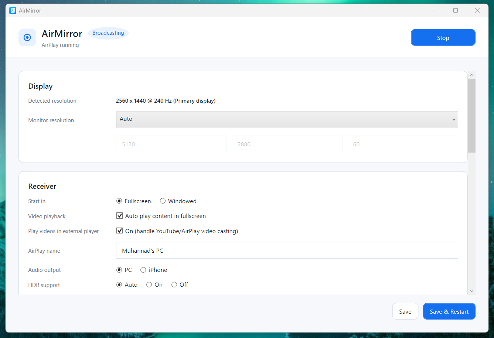
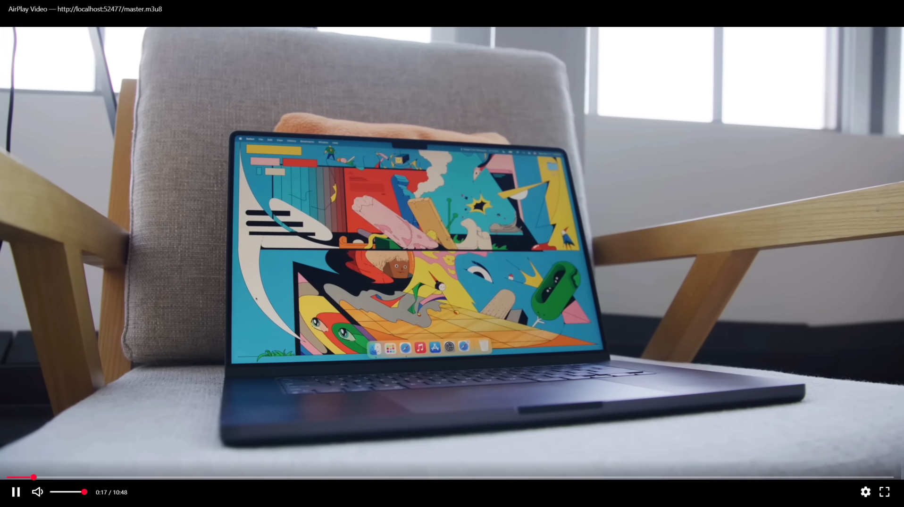

<h1 align="left">
  
  &nbsp;AirMirror
</h1>

**AirMirror** is a native Windows app that adds an AirPlay receiver to your PC — mimicking macOS's AirPlay as close as possible. Mirror your iPhone, iPad, or Mac screen, stream YouTube videos, and play music wirelessly. All based on the [UxPlay](https://github.com/FDH2/UxPlay) AirPlay core. Enjoy!

<p align="center">
  
</p>

<table>
  <tr>
    <td align="center" width="50%">
      
      <br/><sub>Main app window</sub>
    </td>
    <td align="center" width="50%">
      
      <br/><sub>Built-in video player</sub>
    </td>
  </tr>
</table>

---

## Features

- **iOS / macOS screen mirroring** — full AirPlay mirroring, hardware-accelerated D3D12 renderer.
- **AirPlay video handoff** — YouTube, Apple TV, Safari etc. supports proper HLS stream playback.
- **Stream audio from your iPhone** as you would to a HomePod — straight to your PC speakers.
- **Pick any AirPlay name you want!** Set it during install, change it any time in Settings.
- **Automatically selects your monitor's resolution.**
- **Auto-launch with Windows** for the most native feel.

---

## Installation

1. Go to the [**Releases**](../../releases) tab.
2. Download the installer for your CPU:
   - **Windows x64**: `AirMirror-Setup-<version>-x64.exe` *(if you don't know which to pick, choose this one)*
   - **Windows ARM64**: `AirMirror-Setup-<version>-arm64.exe`
3. Run the installer and follow the wizard.
4. On your iPhone/iPad/Mac, open Control Center → **Screen Mirroring** (or use the AirPlay button in YouTube / Music / Photos) and pick your PC.

To **uninstall**, use *Settings → Apps → Installed apps → AirMirror → Uninstall*.

---

## How to Build & Compile from Source

### Prerequisites

| Tool | Why |
| --- | --- |
| [.NET 8 SDK](https://dotnet.microsoft.com/download/dotnet/8.0) | Builds the WPF app (`win-x64` / `win-arm64`). |
| [MSYS2](https://www.msys2.org/) with the **UCRT64** environment | Builds UxPlay (the C/C++ AirPlay core). |
| [Inno Setup 6](https://jrsoftware.org/isinfo.php) | *(Optional)* Compiles the Windows installer. |
| Git | To clone this repo. |

### 1. Clone

```powershell
git clone https://github.com/MuhannadYT/AirMirror.git
cd AirMirror
```

### 2. Build UxPlay (the AirPlay receiver core)

UxPlay is a C/C++ project, so it's built inside the **MSYS2 UCRT64** environment on Windows. Open the **MSYS2 UCRT64** shell (from the Start menu) and install its build dependencies using `pacman` (MSYS2's package manager):

```bash
pacman -S --needed mingw-w64-ucrt-x86_64-toolchain \
                   mingw-w64-ucrt-x86_64-cmake \
                   mingw-w64-ucrt-x86_64-ninja \
                   mingw-w64-ucrt-x86_64-pkgconf \
                   mingw-w64-ucrt-x86_64-libplist \
                   mingw-w64-ucrt-x86_64-openssl \
                   mingw-w64-ucrt-x86_64-gstreamer \
                   mingw-w64-ucrt-x86_64-gst-plugins-base \
                   mingw-w64-ucrt-x86_64-gst-plugins-good \
                   mingw-w64-ucrt-x86_64-gst-plugins-bad \
                   mingw-w64-ucrt-x86_64-gst-libav
```

Then configure & build (still inside the UCRT64 shell):

```bash
cd /c/path/to/AirMirror/third_party/UxPlay
cmake -S . -B build-ucrt64 -G Ninja -DNO_MARCH_NATIVE=ON
cmake --build build-ucrt64
```

Stage the resulting `uxplay.exe` so the WPF project picks it up (run this in **PowerShell**, from the repo root):

```powershell
Copy-Item -Force third_party\UxPlay\build-ucrt64\uxplay.exe `
                 src\AirMirror\tools\uxplay\uxplay.exe
```

### 3. Build the WPF app

From a normal PowerShell prompt at the repo root:

```powershell
dotnet build src\AirMirror\AirMirror.csproj -c Release -r win-x64
```

Run it directly (skips the installer):

```powershell
& "src\AirMirror\bin\Release\net8.0-windows10.0.19041.0\win-x64\AirMirror.exe"
```

### 4. (Optional) Build the installer

```powershell
.\scripts\build-installer.ps1
```

This publishes a self-contained `win-x64` build under `src\AirMirror\bin\Release\...\publish\` and runs Inno Setup (`installer\AirMirror.iss`) to produce `dist\AirMirror-Setup-<version>-x64.exe`.

If `ISCC.exe` isn't on your `PATH`, set `$env:ISCC` to its full path (typically `C:\Program Files (x86)\Inno Setup 6\ISCC.exe`).

---

## Repository Layout

```
src/AirMirror/      # WPF app (.NET 8, win-x64 / win-arm64)
third_party/UxPlay/ # Vendored UxPlay sources + Windows patches
installer/          # Inno Setup script
scripts/            # PowerShell helpers (build UxPlay, build installer)
docs/images/        # Logo + screenshots used by this README
```

---

## Credits

Made with ❤ by [**MuhannadYT**](https://github.com/MuhannadYT).

Powered by [**UxPlay**](https://github.com/FDH2/UxPlay) — thanks to all of its developers ❤. UxPlay is licensed under the GPL; see [`third_party/UxPlay/LICENSE`](third_party/UxPlay/LICENSE).

---

## License

AirMirror is licensed under the **GNU Affero General Public License v3.0 (AGPL-3.0)**. See [LICENSE](LICENSE) for the full text.

In short:

- You are free to use, study, modify, and share AirMirror.
- If you distribute it **or run a modified version that users interact with over a network**, you must publish your modified source code under AGPL-3.0 as well.
- This means you cannot take AirMirror, fold it into a closed-source product, and ship that — any derivative work must remain open source under AGPL-3.0.

The bundled UxPlay binary inside the installer remains licensed under **GPL-3.0** (its original license, compatible with AGPL-3.0). Its source lives under [`third_party/UxPlay/`](third_party/UxPlay).
